# Dashboard Examples

Application Study Tool includes a variety of starter dashboards to help monitor your BigIP devices.
These dashboards are built in Grafana and can be customized to suit your unique organizational needs.

1. TOC
{:toc}

## Accessing the dashboards

#### View The Dashboards
Once you have deployed the application, you can access the dashboards at `http://<hostname>:3000`, the default Grafana user/pass is `admin/admin`.

* Grafana Instance with pre-configured dashboards for quick insights at the device and "fleet" levels.

#### Changing the Grafana Credentials

You can update the Grafana user/pass by changing the values of the `GF_SECURITY_ADMIN_USER` and `GF_SECURITY_ADMIN_PASSWORD` `.env` variables

### Fleet Dashboards

The fleet dashboards provide top level information of your environment

#### Inventory
*The inventory dashboard allows you to view the differences between BigIP devices in your inventory.*
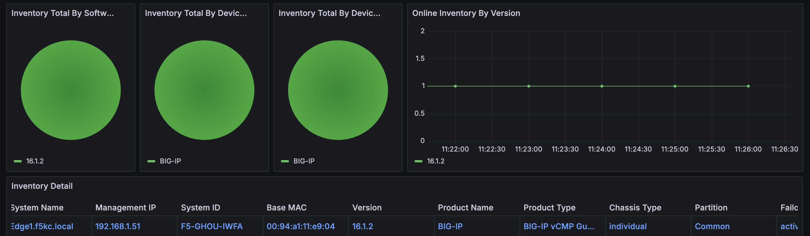

#### Device Utilization
*This dashboard provides a quick view on how much usage your box is receiving. To view more information about the device take a look at the [device overview dashboard](#overview).*
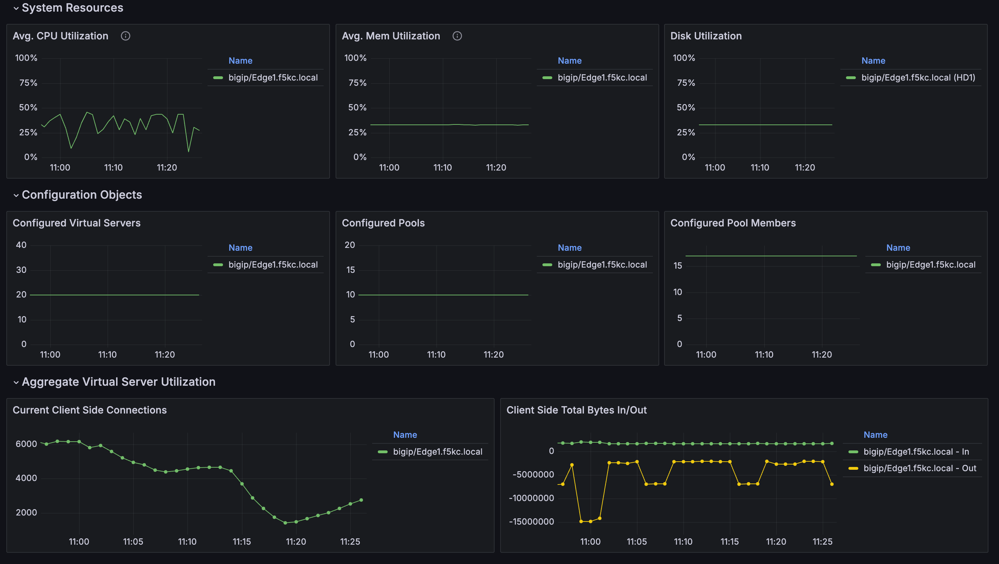

#### Virtual Servers
*The Virtual Server dashboard provides an overview of all the virtual servers present in your inventory.*
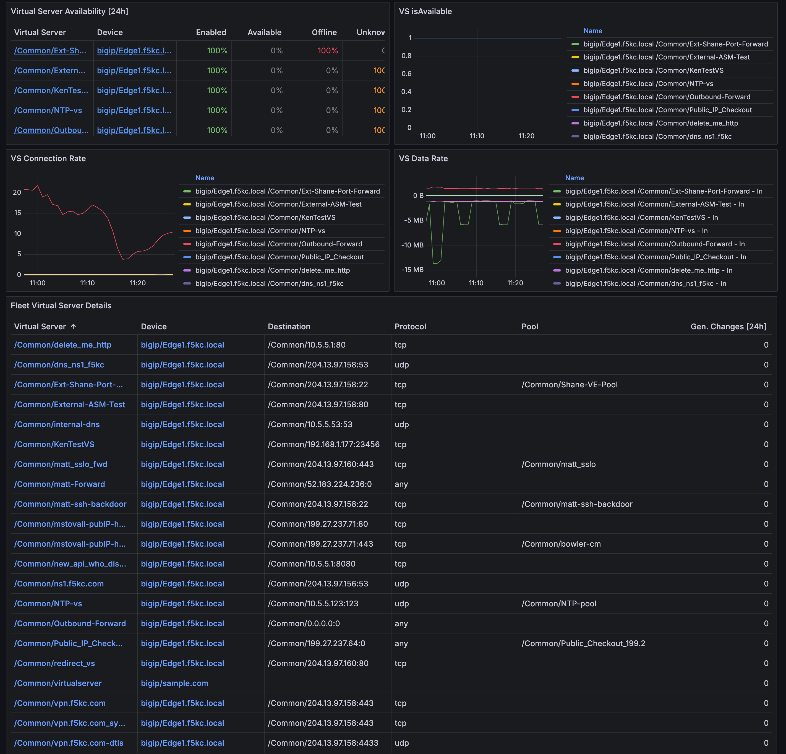

#### SSL Certs
*The SSL Certs view allows you to stay up to date on the status of your SSL certficates.*
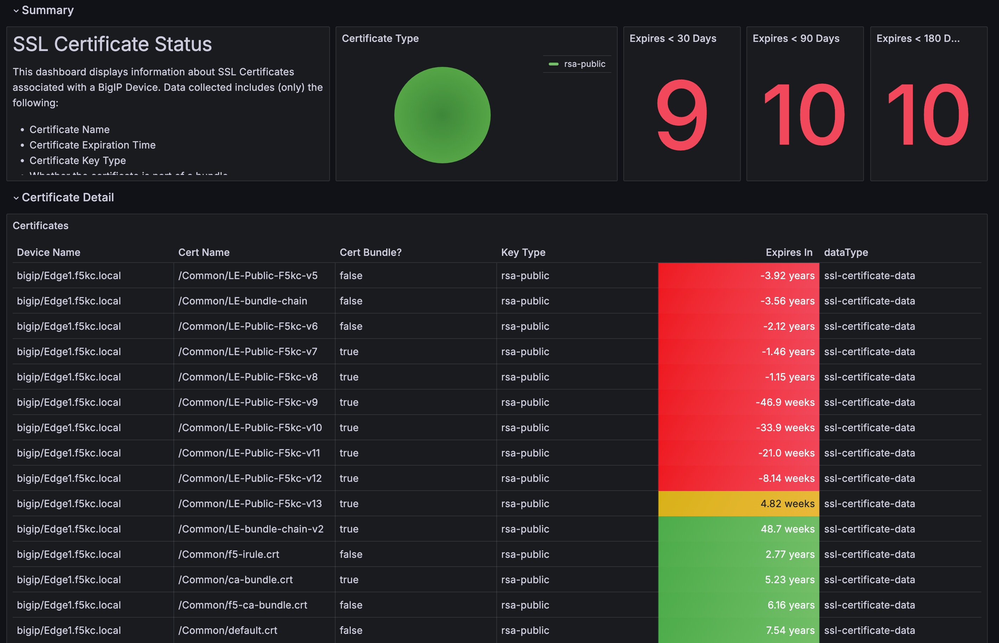

### Device Dashboards

The device dashboards provide more grainular information about how the device is configured and how it is performing

#### Overview
*This dashboard provides variety of metrics about the performance of the device.*
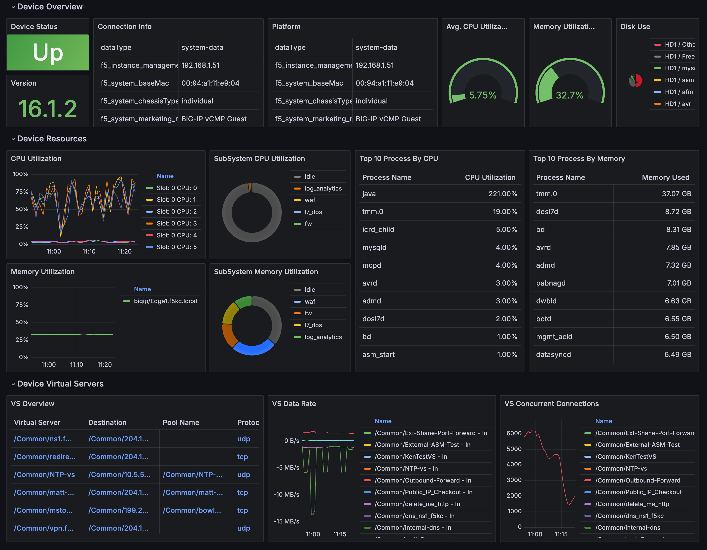
#### Top N
*The Top N dashboard provides statistical highlights by presenting stats in a Top N, by default N is set to 10 this can be changed at top of the dashboard*
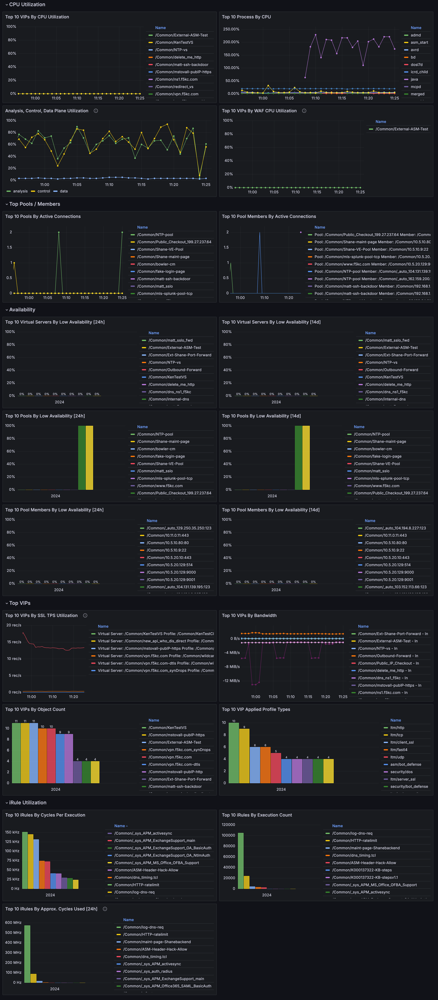
#### Pools
*Here you can view stats pertaining to Pools and Pool members on a BigIP.*
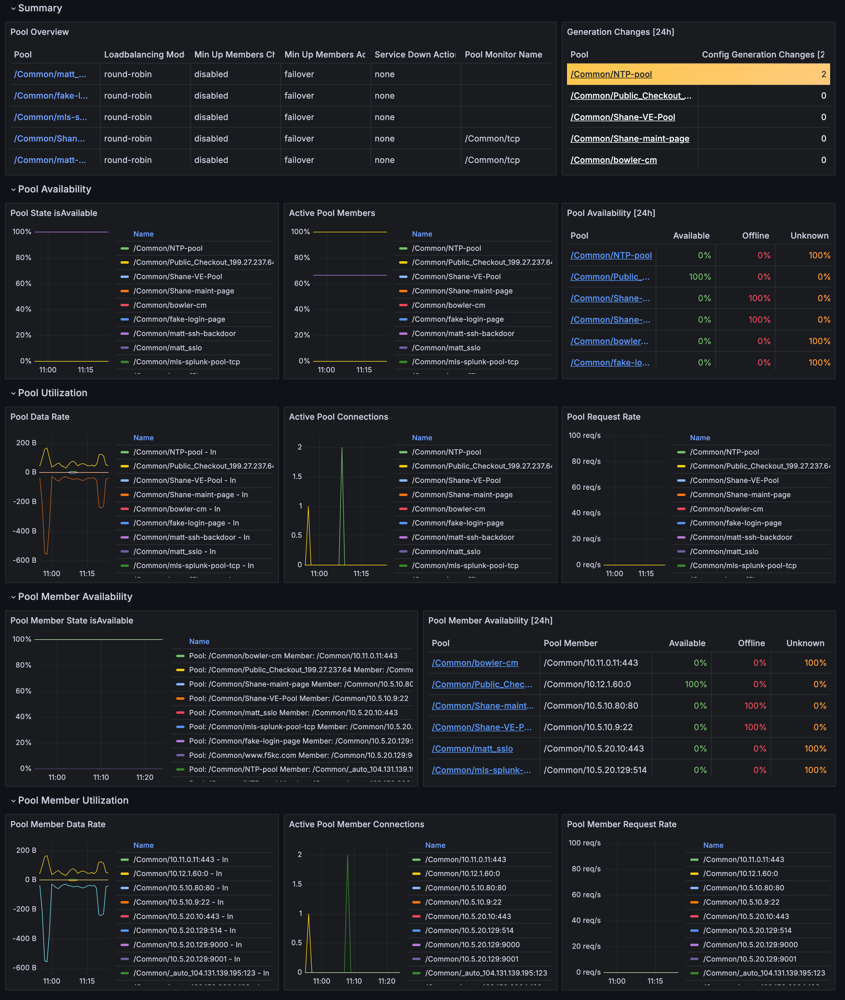

#### Virtual Servers
*Here you can view stats pertaining to all the virtual servers on a BigIP.*
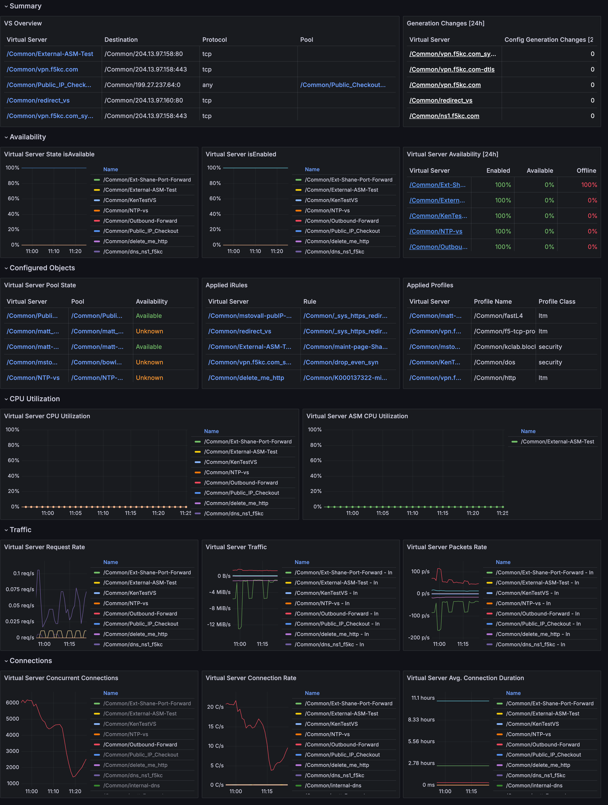

#### iRules
*This dashboard allows you to monitor iRule usage and performance.*
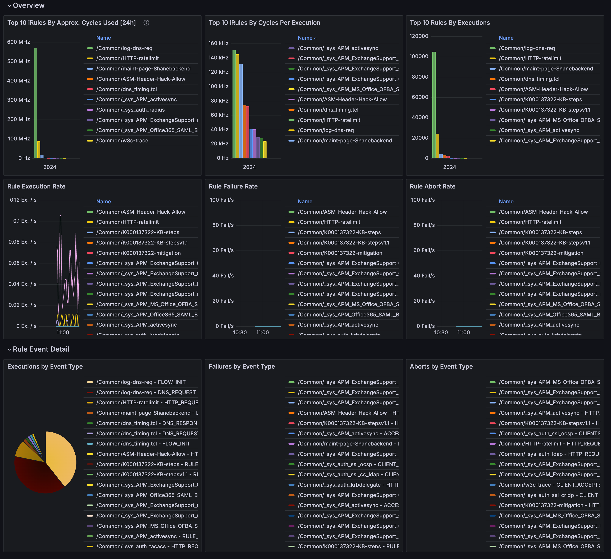

#### WAF
*View the status of your WAF policies here.*
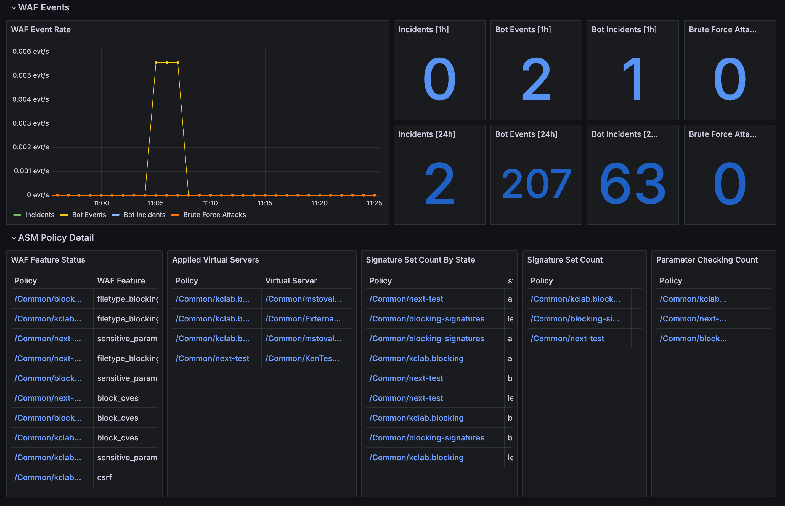

### Profile Dashboards

The profile dashboards dive into the different profiles configured on the devices and provide metrics about the traffic the profiles are receiving

#### HTTP

*This dashboard enables the user to monitor their HTTP profiles, view information pretaining to HTTP requests and responses*
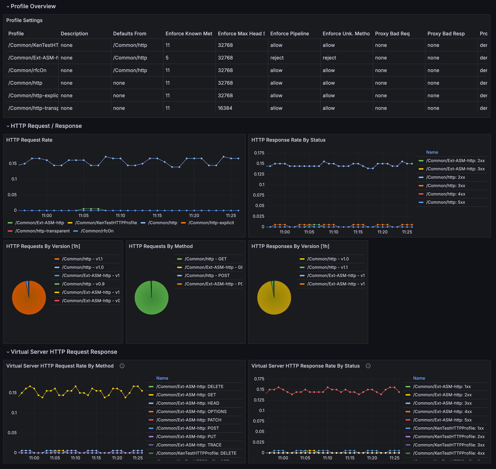

### Collector Stats

You can view stats about the Collector from the scrape duration to API requests/responses

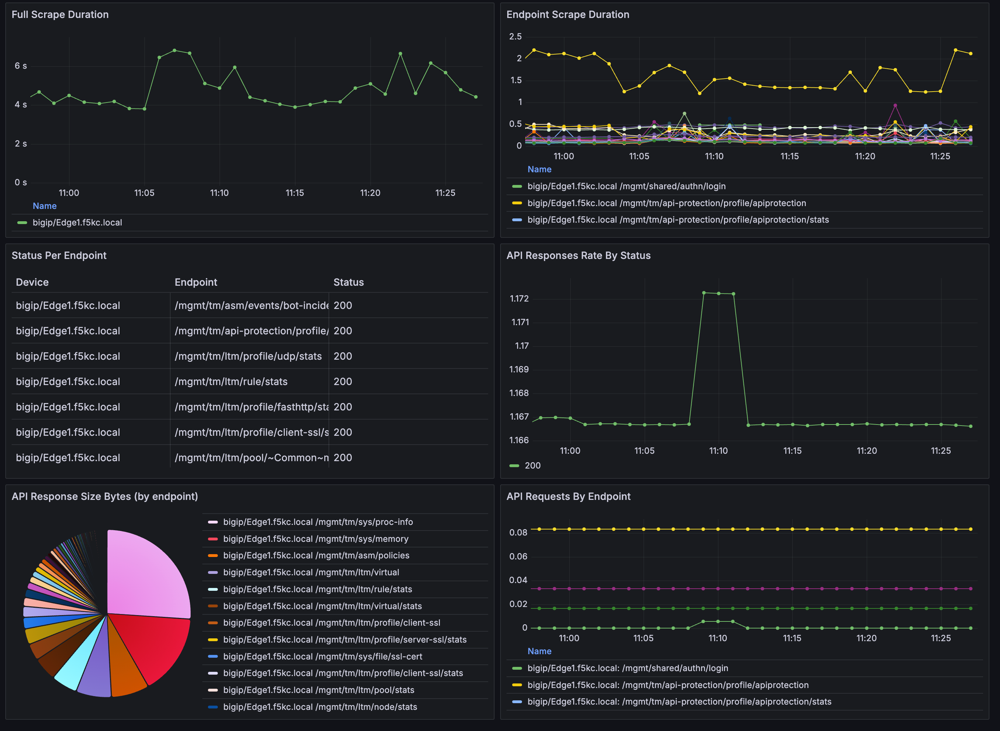