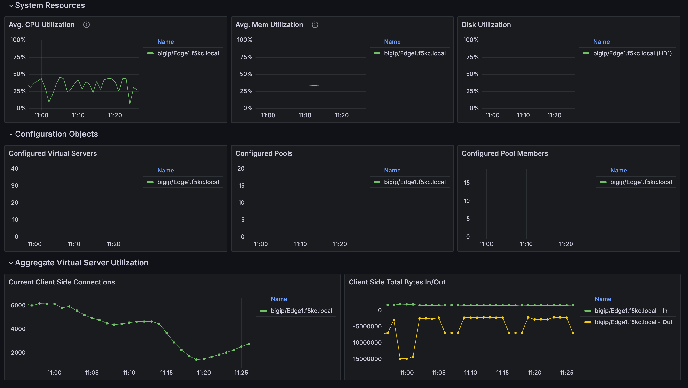
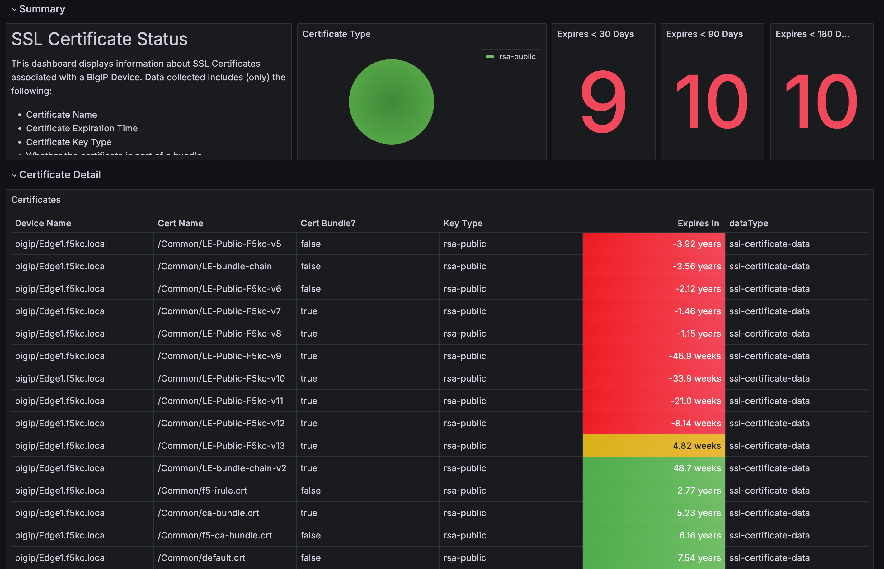
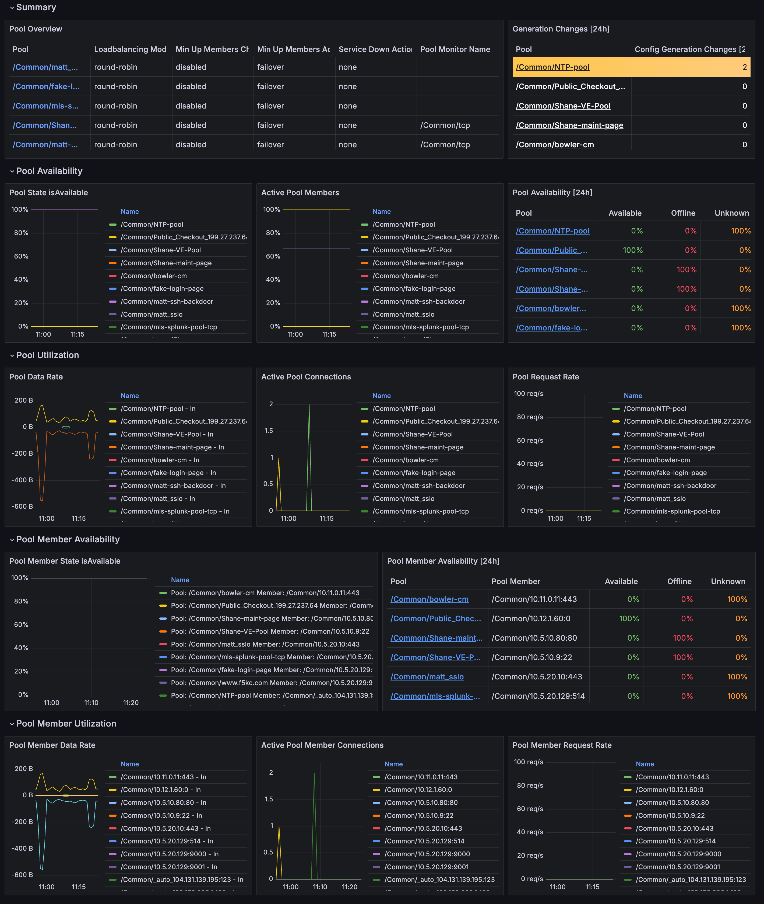
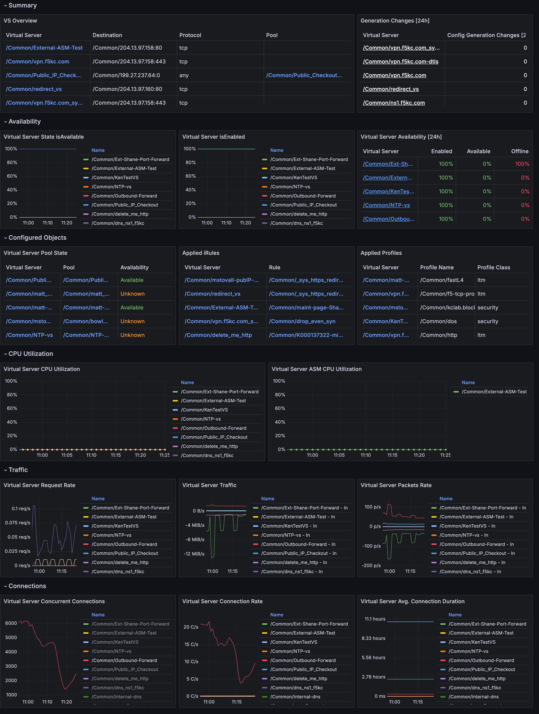
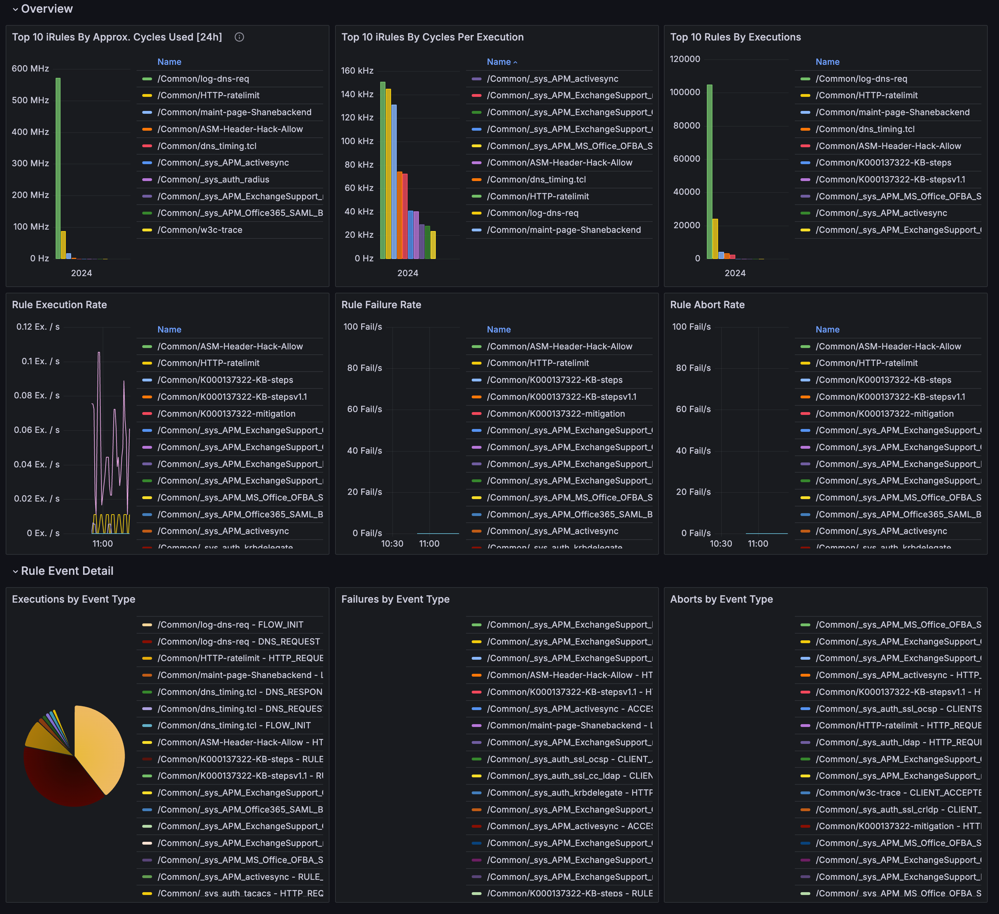
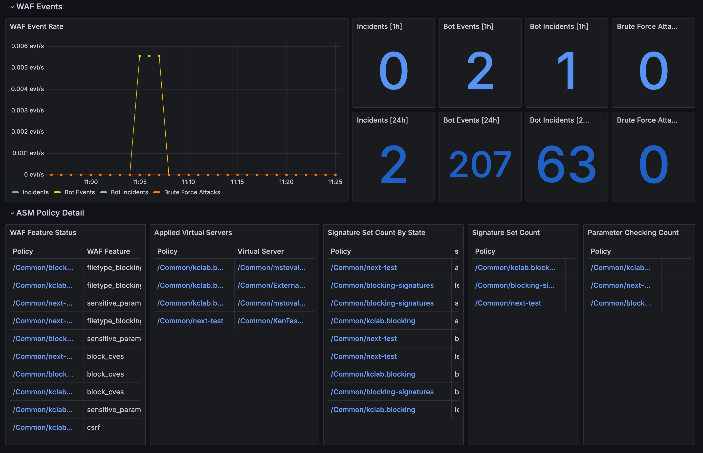
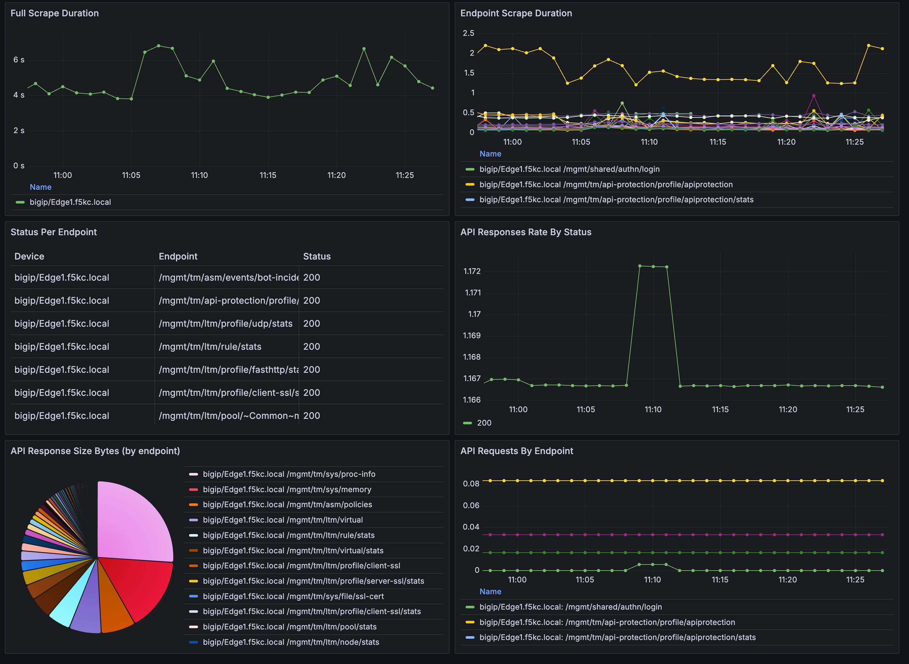

# Dashboards

We provide a variety of dashboards to help monitor your BigIP devices, these dashboards are built in Grafana which makes it super flexible to apply changes. Below you will find all the dashboards you will get access to when you deploy the application.

## Table of Contents
- [Fleet](#fleet-dashboards)
    - [Inventory](#inventory)
    - [Device Utilization](#device-utilization)
    - [Virtual Servers](#virtual-servers)
    - [SSL Certs](#ssl-certs)
- [Device](#device-dashboards)
    - [Overview](#overview)
    - [Top N](#top-n)
    - [Pools](#pools)
    - [Virtual Servers](#virtual-servers-1)
    - [iRules](#irules)
    - [WAF](.dashboard.)
- [Profile](#profile-dashboards)
    - [HTTP](#http)
- [Stats](#collector-stats)

## Accessing the dashboards

#### View The Dashboards
Once you have deployed the application, you can access the dashboards at `http://<hostname>:3000`, the default Grafana user/pass is `admin/admin`.

* Grafana Instance with pre-configured dashboards for quick insights at the device and "fleet" levels.

#### Changing the Grafana Credentials

You can update the Grafana user/pass by changing the values of the `GF_SECURITY_ADMIN_USER` and `GF_SECURITY_ADMIN_PASSWORD` `.env` variables

### Fleet Dashboards

The fleet dashboards provide top level information of your environment

#### Inventory

*The inventory dashboard allows you to view the differences between BigIP devices in your inventory.*

#### Device Utilization

*This dashboard provides a quick view on how much usage your box is receiving. To view more information about the device take a look at the [device overview dashboard](#overview).*

#### Virtual Servers

*The Virtual Server dashboard provides an overview of all the virtual servers present in your inventory.*

#### SSL Certs

*The SSL Certs view allows you to stay up to date on the status of your SSL certficates.*

### Device Dashboards

The device dashboards provide more grainular information about how the device is configured and how it is performing

#### Overview

*This dashboard provides variety of metrics about the performance of the device.*
#### Top N

*The Top N dashboard provides statistical highlights by presenting stats in a Top N, by default N is set to 10 this can be changed at top of the dashboard*
#### Pools

*Here you can view stats pretaining to Pools and Pool members on a BigIP.*

#### Virtual Servers

*Here you can view stats pretaining to all the virtual servers on a BigIP.*

#### iRules

*This dashboard allows you to monitor iRule usage and performance.*

#### WAF

*View the status of your WAF policies here.*

### Profile Dashboards

The profile dashboards dive into the different profiles configured on the devices and provide metrics about the traffic the profiles are receiving

#### HTTP

*This dashboard enables the user to monitor their HTTP profiles, view information pretaining to HTTP requests and responses*

### Collector Stats

You can view stats about the Collector from the scrape duration to API requests/responses

